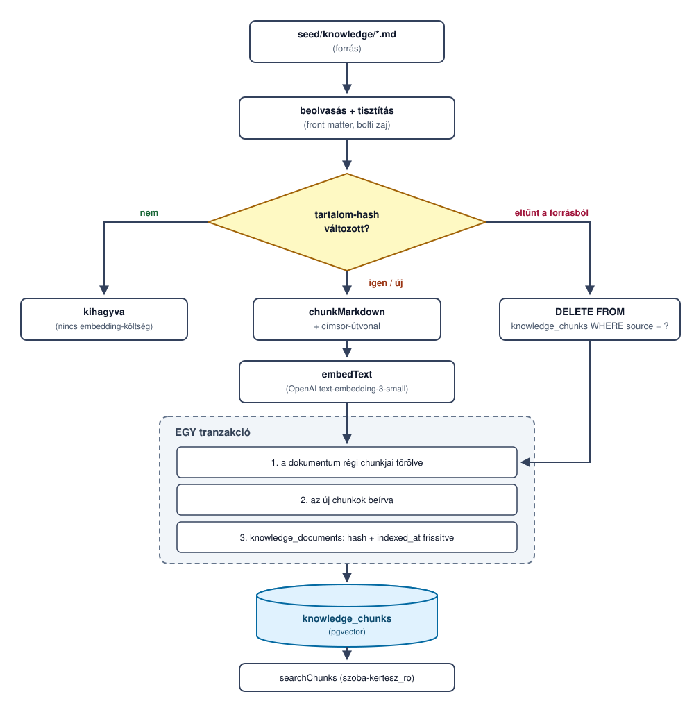
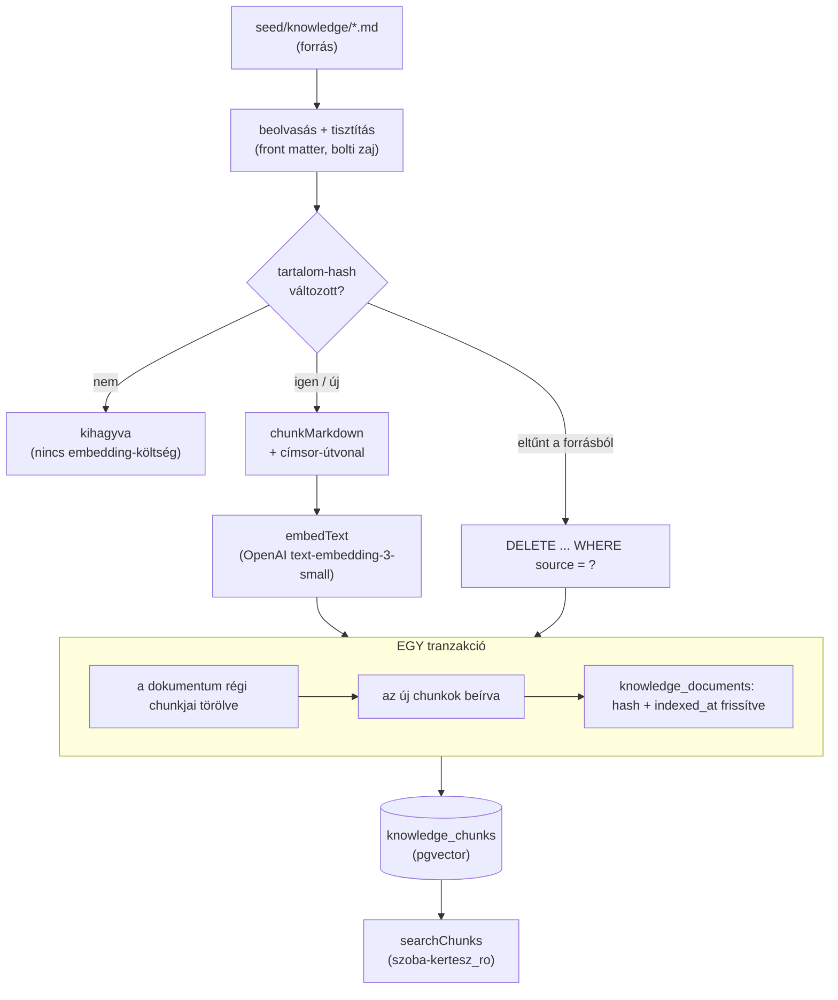

# A tudásbázis karbantartása — architektúra-terv

> Ez **terv, nem implementáció**. A mai rendszer teljes újraépítést csinál
> (`pnpm knowledge:ingest` = `TRUNCATE` + újratöltés), és a mi korpuszunknál ez a helyes válasz.
> Ez a dokumentum azt írja le, **mi lenne, ha nem az lenne** — mert egy tudásbázis nem statikus:
> a bolt holnap ír egy új cikket, átírja a régit, töröl egyet, és ettől a vektorok még a tegnapi
> igazságot mondják.
>
> A monorepo szerkezetéről és a kód-architektúráról a [`docs/architektura-monorepo.md`](architektura-monorepo.md) szól.

## A mai állapot — és miért elég ma

| mutató | érték |
|---|---|
| dokumentum | 202 (`seed/knowledge/*.md`) |
| chunk | 1906 |
| embedding-hívás egy újraépítésnél | 1906 darab, 100-as kötegekben = 20 hívás |
| stratégia | teljes újraépítés: `TRUNCATE knowledge_chunks` + újratöltés |

Egy teljes újraépítés néhány perc és néhány cent (a részletes költségbecslés a
[README](../README.md#költségbecslés)-ben). **Az inkrementalitás ára ma nagyobb, mint a haszna:**
egy hash-tábla karbantartása, a törlés-ág biztonsági korlátai és a tranzakciókezelés több kódot és
több hibalehetőséget jelentene, mint amennyi percet és centet megspórolna.

Ezt ki kell mondani, nem elfedni. A „teljes újraépítés" nem lustaság, hanem **méretarányos döntés** —
és pontosan attól méretarányos, hogy tudjuk, hol veszíti el az érvényét.

## Mikor törik el ez a válasz

Három küszöb, bármelyik elég:

1. **Méret.** Nagyságrendileg **10 000 chunk** fölött az újraépítés ideje és költsége már nem
   elhanyagolható: a mi 1906 darabunk 20 embedding-hívás, 20 000 darab már 200 — és ezt fizetnénk
   akkor is, ha egyetlen cikk változott.
2. **Frissítési gyakoriság.** Ha a korpusz **naponta többször** változik, az újraépítés ablakában a
   tudásbázis hiányos: a `TRUNCATE` után, a betöltés végéig a `searchKnowledge` üres vagy fél
   korpuszt lát. Ez ma elviselhető (kézzel, ritkán futtatjuk), napi több futásnál nem az.
3. **Rendelkezésre állás.** Amint a keresés éles forgalmat szolgál ki, a „néhány perc üres tábla"
   nem opció — akkor az alábbi inkrementális út **kötelező**, nem választható.

## 1. Honnan tudjuk, hogy egy dokumentum változott

Egy új tábla tartja nyilván, mit indexeltünk:

```prisma
model KnowledgeDocument {
  source      String   @id  // a cikk URL-je — ez az azonosító, nem a fájlnév
  contentHash String   @map("content_hash")
  chunkCount  Int      @map("chunk_count")
  indexedAt   DateTime @map("indexed_at")

  @@map("knowledge_documents")
}
```

A `contentHash` a **megtisztított törzs** hashe (SHA-256), nem a nyers fájlé. Ez lényeges: a fájl
front matterében a letöltés dátuma is szerepel, tehát a nyers fájl hashe akkor is változna, ha a
cikk szövegéhez senki nem nyúlt — és minden újraletöltés után az egész korpuszt újravektorizálnánk.

A `source` azért az azonosító, mert **az a stabil**: a fájlnév a letöltő szkript terméke, az URL a
cikké. Ugyanez az oszlop köti össze a chunkokkal.

Ami nem változott, **nem kerül a modell elé**: se chunkolás, se embedding, se írás.

## 2. Mi történik az ÚJ dokumentummal

Nincs sora a `knowledge_documents` táblában → ugyanaz az út, mint a módosultnál, csak törölnivaló
nélkül: chunkolás → embedding → beírás → a hash-sor létrehozása.

Egy részlet, ami miatt ez tényleg ilyen egyszerű: a `chunk_index` **dokumentumon belül** indul 0-tól
(`schema.prisma:22`), tehát az új dokumentum darabjai nem ütköznek a meglévőkkel. Nincs globális
sorszám, amit karban kellene tartani, és nincs újraszámozás.

## 3. Mi történik a TÖRÖLT dokumentum chunkjaival

A törlést **halmazkülönbség** adja: ami a `knowledge_documents`-ben szerepel, de a forrásban már
nincs. A takarítás a `source` oszlopon megy:

```sql
DELETE FROM knowledge_chunks WHERE source = $1;
DELETE FROM knowledge_documents WHERE source = $1;
```

A séma erre **ma is fel van készítve**: a `@@index([source])` (`schema.prisma:27`) miatt ez a törlés
indexelt, nem teljes tábla-olvasás.

**A kockázat itt nagyobb, mint bárhol máshol a folyamatban**, és nevén kell nevezni: ha a forrás
beolvasása *részlegesen* sikerül — hálózati mount tűnik el, egy fájl olvashatatlan, a szinkron
félbeszakad —, akkor a halmazkülönbség **hamisan mutat törlést**, és a takarítás kiüríti a
tudásbázist. Két korlát véd ez ellen:

- a törlés-ág **csak hiánytalan beolvasás után** fut; ha a beolvasás bármelyik fájlon hibázott, a
  futás módosít és beszúr, de **nem töröl**;
- **százalékos biztonsági korlát**: ha a dokumentumok több mint 20%-a tűnne el egyetlen futásban, a
  szkript megáll és jelez, ahelyett hogy törölne. Ez a fajta hiba mindig tömeges — egy valódi,
  szándékos nagy törlés pedig megéri a kézi jóváhagyást.

## 4. Mi történik a MÓDOSULT dokumentummal

A régi chunkok törlése, az újak beírása és a hash frissítése **egyetlen tranzakcióban**:

```sql
BEGIN;
  DELETE FROM knowledge_chunks WHERE source = $1;
  INSERT INTO knowledge_chunks (...) VALUES ...;      -- az új darabok
  UPDATE knowledge_documents SET content_hash = $2, chunk_count = $3, indexed_at = now()
   WHERE source = $1;
COMMIT;
```

Két külön ok is van rá, és mindkettő valódi hibát zár ki:

- **Ha a törlés és a beírás külön menne**, egy megszakadt futás után a keresés fél dokumentumot
  látna — a régi darabok egy része eltűnt, az újak egy része nincs meg. Ez a fajta hiba néma: a
  válasz nem hibaüzenet lesz, hanem egy hiányos válasz.
- **Ha a hash frissítése külön menne**, egy bukott beírás után a hash már „naprakészt" mutatna, és a
  dokumentum **soha többé nem indexelődne újra**. A hiba önmagát fedné el.

Az embedding-hívások a tranzakción **kívül** futnak (előbb megvan az összes vektor, utána nyílik a
tranzakció) — egy több másodperces API-hívás alatt nem tartunk nyitva írási tranzakciót.

## 5. Mi triggereli az újraindexelést

Három út, növekvő érettségi sorrendben:

| # | trigger | mikor jó | ár |
|---|---|---|---|
| a | **kézi futtatás** (`pnpm knowledge:ingest`) — *ez van ma* | ritkán változó korpusz, egy fejlesztő | valaki elfelejti lefuttatni |
| b | **ütemezett futás** (cron, pl. éjszakánként) | rendszeresen, de nem azonnal frissülő korpusz | a hash-összevetés miatt **olcsó**: a változatlan dokumentumokért nem fizet, csak beolvas és hasht |
| c | **esemény-vezérelt** (a forrásoldali CMS webhookja) | ha a frissesség perc-kérdés | infrastruktúra: végpont, hitelesítés, sorbaállítás, újrapróbálkozás |

**A mi korpuszunkhoz a (b) illik**, ha egyszer túlnőjük a kézi futtatást: a cikkek nem óránként
változnak, viszont a hash-alapú kihagyás miatt egy éjszakai futás ára közel nulla, ha nem történt
semmi. A (c) csak akkor éri meg, ha a bolt szerkesztősége tényleg naponta publikál.

## 6. Adatfolyam



A forrás (a fenti SVG ebből készült):



Az ábrán az a lényeg, ami a mai rendszerből hiányzik: a **hash-elágazás** (ami nem változott, nem
kerül a modell elé) és a **törlés útja** (ami eltűnt a forrásból, eltűnik a tudásbázisból is).

## 7. Amit szándékosan nem old meg ez a terv

| nem old meg | miért elfogadható |
|---|---|
| **Verziózás** — a régi chunkok nem őrződnek meg, a módosult dokumentum előző állapota elvész. | A tudásbázis a *mai* gondozási tanácsot szolgálja ki; egy tavalyi öntözési tanács visszakereshetősége nem érték. Ha kellene, a forrás-repóban a git úgyis őrzi a cikkek szövegét. |
| **Chunk-szintű diff** — ha egy dokumentum egyetlen bekezdése változik, az **egész** dokumentum újraindexelődik. | A mi cikkeink mediánja 9-10 darab; a megspórolható embedding-hívás töredéke a bonyolításnak. Egy chunk-szintű diffhez darabonkénti hash és stabil darab-azonosító kellene, miközben a chunkolás határai maguk is elmozdulnak a szöveg változásától. |
| **Embedding-modell migráció** — modellváltásnál a **teljes** korpuszt újra kell vektorizálni. | A régi és az új modell vektorai nem összemérhetők, tehát részleges migráció nem létezik: a félig migrált tábla keresési eredménye értelmezhetetlen. Ez viszont ritka esemény, és pontosan az a helyzet, amire a mai teljes újraépítés amúgy is jó. |
| **Párhuzamos futás elleni védelem** — két egyszerre indított ingest összeakadhat. | Ma kézi, egyszemélyes futtatás. Ütemezett futásnál viszont kell egy lock (pl. `pg_advisory_lock`) — ez a (b) trigger bevezetésének a feltétele, nem külön feladat. |
