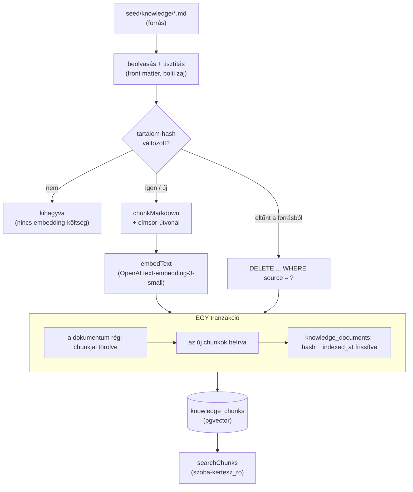

# HF3 leadandók — implementációs terv

> **For agentic workers:** REQUIRED SUB-SKILL: Use superpowers:subagent-driven-development (recommended) or superpowers:executing-plans to implement this plan task-by-task. Steps use checkbox (`- [ ]`) syntax for tracking.

**Goal:** A 06. alkalom RAG-pipeline-jára ráépíteni a HF3 hiányzó öt leadandóját — chunking-továbbfejlesztés indoklással, golden set negatív teszttel, `docs/ARCHITEKTURA.md` ábrával, költségbecslés és multi-provider szereposztás.

**Architecture:** A `chunkMarkdown` egy opcionális `docTitle`-t kap, és minden darab elé beírja a címsor-útvonalat (`How To Care for a Snake Plant › Water`) — ez a `content` mezőbe megy, tehát nincs migráció. Mellette kiesnek a törzs nélküli, csak-címke darabok. A hatást egy új üzemeltetői szkript (`pnpm golden:run`) méri, ugyanazon a `retrieveKnowledge`-en kétféle beállítással; a mérés kétszer fut — a chunker átírása **előtt** és **után**.

**Tech Stack:** TypeScript (strict) · Vitest · tsx · Zod · a meglévő `packages/core/src/lib/rag/` modulok · pgvector · OpenAI `text-embedding-3-small` · Claude Haiku 4.5 (HyDE + rerank)

**Spec:** `docs/superpowers/specs/2026-08-20-hf3-leadandok-design.md`

## Global Constraints

- **Commit, push, PR CSAK külön kérésre.** Minden Task „Commit" lépése előtt meg kell állni és felajánlani — a kurzus végrehajtási protokollja ezt írja elő. Commit-üzenet: magyar tárgysor, a Task a végén zárójelben (`feat: … (Task 4)`), Conventional Commits, kisbetűvel a kettőspont után, **trailer nélkül**.
- **Egy Task egy körben.** A Task végén beszámoló, utána megállás.
- **Fizetős vagy DB-t író futás előtt külön rákérdezés.** Ez a Task 3, 6 és 7 (valódi OpenAI- és Anthropic-hívások; a Task 6 ráadásul TRUNCATE-el).
- **A kritikus sorrend nem cserélhető fel:** a Task 3 („előtte" mérés) a Task 4 (chunker átírása) **előtt** fut. Ha a chunker előbb változik, az alapvonal elveszett, és csak egy újabb fizetős ingesttel szerezhető vissza.
- **Tesztek `nx`-en keresztül**, soha közvetlen `vitest`-tel: a közvetlen hívás nem kapja meg a gyökér `.env`-et, és némán hamis eredményt ad. `pnpm nx test core` / `pnpm nx test cli`.
- **Nincs `console.log` termékkódban** — az üzemeltetői szkriptek (`ingest-knowledge.ts`, `embed-demo.ts`, az új `golden-run.ts`) a kimondott kivételek.
- **`unknown` a külső bemenetre, soha `any`**; Zod-validálás a rendszerhatáron, fail-fast.
- **A `packages/core` nem tud a belépési pontjáról** — a golden-szkript az `apps/cli`-be megy, nem a core-ba.
- Ismert flake, nem regresszió: a `db-readonly.spec.ts` „sorszám változatlan" állítása versenyzik az `upsert-product-db.spec.ts`-sel. Ha csak ez az egy teszt bukik sorszám-eltérésen, futtasd újra.

---

## File Structure

**Új fájlok:**

| fájl | felelősség |
|---|---|
| `apps/cli/src/lib/repo-root.ts` | a repo gyökeréhez képesti út felfelé keresése (ma `ingest-knowledge.ts`-ben duplikálva áll) |
| `apps/cli/src/lib/repo-root.spec.ts` | a kereső tesztjei |
| `apps/cli/src/lib/golden-questions.ts` | a kérdésfájl beolvasása + Zod-validálás |
| `apps/cli/src/lib/golden-questions.spec.ts` | a séma tesztjei |
| `apps/cli/src/lib/golden-report.ts` | a mérés → markdown formázás (tiszta függvény) |
| `apps/cli/src/lib/golden-report.spec.ts` | a formázó tesztjei |
| `apps/cli/src/golden-run.ts` | a futtató szkript (`pnpm golden:run`) |
| `seed/golden-set.json` | a 8 kérdés, verziókövetve |
| `docs/golden/futas-regi-chunker.md` | **generált** mérés (Task 3) |
| `docs/golden/futas-uj-chunker.md` | **generált** mérés (Task 7) |
| `docs/golden-set.md` | **kézzel írt** elemzés — leadandó |
| `docs/chunking-strategia.md` | **kézzel írt** indoklás — leadandó |
| `docs/ARCHITEKTURA.md` | **kézzel írt** karbantartási terv + ábra — leadandó |
| `docs/img/tudasbazis-adatfolyam.svg` | az ábra exportja |

**Módosuló fájlok:**

| fájl | mi változik |
|---|---|
| `packages/core/src/lib/rag/chunk.ts` | `docTitle` opció, címsor-útvonal, törzs nélküli darabok eldobása |
| `packages/core/src/lib/rag/chunk.spec.ts` | öt új eset |
| `apps/cli/src/ingest-knowledge.ts` | `docTitle` átadása + a duplikált gyökér-kereső cseréje |
| `package.json` (gyökér) | `golden:run` szkript |
| `docs/architektura.md` | **átnevezve** `docs/architektura-monorepo.md`-re |
| `README.md` | költségbecslés + multi-provider szereposztás + a hivatkozás átírása |
| `CLAUDE.md` | átvezetés |

---

## Task 1: Repo-gyökér kereső + a golden set kérdésfájlja

**Files:**
- Create: `apps/cli/src/lib/repo-root.ts`
- Create: `apps/cli/src/lib/repo-root.spec.ts`
- Create: `apps/cli/src/lib/golden-questions.ts`
- Create: `apps/cli/src/lib/golden-questions.spec.ts`
- Create: `seed/golden-set.json`
- Modify: `apps/cli/src/ingest-knowledge.ts:41-63` (a duplikált `findKnowledgeDir` cseréje)

**Interfaces:**
- Consumes: semmit (ez az első Task)
- Produces:
  - `findRepoPath(...segments: string[]): string` — abszolút út; dob, ha nincs meg
  - `interface GoldenQuestion { readonly id: string; readonly question: string; readonly language: 'hu' | 'en'; readonly kind: 'thematic' | 'control' | 'negative'; readonly why: string }`
  - `parseGoldenSet(raw: unknown): GoldenQuestion[]`
  - `loadGoldenSet(): GoldenQuestion[]` — a `seed/golden-set.json`-t olvassa a `findRepoPath`-szal

- [ ] **Step 1: Írd meg a bukó tesztet a gyökér-keresőre**

`apps/cli/src/lib/repo-root.spec.ts`:

```ts
import { existsSync } from 'node:fs';
import { describe, expect, it } from 'vitest';
import { findRepoPath } from './repo-root.js';

/**
 * A szkriptek a repo GYÖKERÉHEZ képesti fájlokat olvasnak (seed/knowledge, seed/golden-set.json).
 * A `process.cwd()`-hez kötve más könyvtárból indítva ENOENT-tel szállnának el, `import.meta.url`-hez
 * kötve pedig nem fordulnának: a CLI CJS-re buildel, ott az import.meta tilos. Ezért keresünk FELFELÉ.
 */
describe('findRepoPath', () => {
  it('megtalálja a korpuszt a repo bármely alkönyvtárából', () => {
    const found = findRepoPath('seed', 'knowledge');

    expect(existsSync(found)).toBe(true);
    expect(found.endsWith('seed/knowledge')).toBe(true);
  });

  it('fájlt is megtalál, nem csak könyvtárat', () => {
    expect(existsSync(findRepoPath('package.json'))).toBe(true);
  });

  it('nem létező útra ÉRTHETŐ MAGYAR hibát dob, nem ENOENT-et', () => {
    expect(() => findRepoPath('nincs-ilyen-konyvtar-xyz')).toThrowError(
      /Nem találom/,
    );
  });
});
```

- [ ] **Step 2: Futtasd, és győződj meg róla, hogy bukik**

Futtatás: `pnpm nx test cli`
Várt: FAIL — `Failed to resolve import "./repo-root.js"`

- [ ] **Step 3: Írd meg a `repo-root.ts`-t**

`apps/cli/src/lib/repo-root.ts`:

```ts
import { existsSync } from 'node:fs';
import { dirname, join } from 'node:path';

// repo-root.ts — a repo gyökeréhez képesti utak feloldása, FELFELÉ keresve.
//
// Miért nem `process.cwd()`? Mert akkor a szkript csak a gyökérből indítva működne.
// Miért nem `import.meta.url`? Mert a CLI CJS-re buildel (esbuild format: cjs),
// és ott az import.meta fordítási hiba.

export function findRepoPath(...segments: string[]): string {
  let dir = process.cwd();
  for (;;) {
    const candidate = join(dir, ...segments);
    if (existsSync(candidate)) {
      return candidate;
    }
    const parent = dirname(dir);
    if (parent === dir) {
      throw new Error(
        `Nem találom a(z) "${segments.join('/')}" utat: sehol nincs meg a jelenlegi ` +
          'könyvtár fölött. A parancsot a repón BELÜLRŐL kell futtatni.',
      );
    }
    dir = parent;
  }
}
```

- [ ] **Step 4: Futtasd — zöldnek kell lennie**

Futtatás: `pnpm nx test cli`
Várt: PASS, a három új eset zöld.

- [ ] **Step 5: Írd meg a bukó tesztet a kérdés-sémára**

`apps/cli/src/lib/golden-questions.spec.ts`:

```ts
import { describe, expect, it } from 'vitest';
import { loadGoldenSet, parseGoldenSet } from './golden-questions.js';

describe('parseGoldenSet', () => {
  const valid = [
    {
      id: 'sargulo-level',
      question: 'Miért sárgulnak a növényem levelei?',
      language: 'hu',
      kind: 'thematic',
      why: 'Klasszikus gondozási kérdés, több cikk is érinti.',
    },
  ];

  it('érvényes listát átenged, olvashatóan tipizálva', () => {
    const parsed = parseGoldenSet(valid);

    expect(parsed).toHaveLength(1);
    expect(parsed[0]?.language).toBe('hu');
    expect(parsed[0]?.kind).toBe('thematic');
  });

  it('ismeretlen `kind` értéket ELUTASÍT — elgépelés ne csússzon át némán', () => {
    const broken = [{ ...valid[0], kind: 'tematikus' }];

    expect(() => parseGoldenSet(broken)).toThrowError(/kind/);
  });

  it('üres kérdés-szöveget elutasít', () => {
    const broken = [{ ...valid[0], question: '' }];

    expect(() => parseGoldenSet(broken)).toThrowError();
  });
});

describe('loadGoldenSet', () => {
  it('a valódi seed/golden-set.json 8 kérdést ad, közte PONTOSAN egy negatívval', () => {
    const questions = loadGoldenSet();

    expect(questions).toHaveLength(8);
    expect(questions.filter((q) => q.kind === 'negative')).toHaveLength(1);
    expect(questions.filter((q) => q.language === 'en')).toHaveLength(2);
    // Az azonosítók egyediek — a jelentés ezekre hivatkozik.
    expect(new Set(questions.map((q) => q.id)).size).toBe(8);
  });
});
```

- [ ] **Step 6: Futtasd — bukik**

Futtatás: `pnpm nx test cli`
Várt: FAIL — `Failed to resolve import "./golden-questions.js"`

- [ ] **Step 7: Írd meg a `golden-questions.ts`-t**

`apps/cli/src/lib/golden-questions.ts`:

```ts
import { readFileSync } from 'node:fs';
import { z } from 'zod';
import { findRepoPath } from './repo-root.js';

// golden-questions.ts — a golden set kérdései. A fájl VERZIÓKÖVETETT (seed/golden-set.json),
// mert a mérés csak akkor összehasonlítható két futás között, ha ugyanaz a kérdéslista fut.
//
// A `kind` nem dísz:
//   thematic — a domain valódi kérdései, magyarul (ez a termék tényleges útja)
//   control  — ANGOL kontroll: itt a nyelvi szakadék nulla, tehát a nyers/teljes különbség
//              TISZTÁN a HyDE és a rerank érdeme, nem a fordításé
//   negative — olyan téma, amiről a korpusz nem szól: a grounding próbája

const QuestionSchema = z.object({
  id: z.string().min(1),
  question: z.string().min(1),
  language: z.enum(['hu', 'en']),
  kind: z.enum(['thematic', 'control', 'negative']),
  why: z.string().min(1),
});

const GoldenSetSchema = z.array(QuestionSchema).min(1);

export type GoldenQuestion = z.infer<typeof QuestionSchema>;

/** Validálás a rendszerhatáron: elgépelt `kind` ne fusson végig 16 fizetős hívásig. */
export function parseGoldenSet(raw: unknown): GoldenQuestion[] {
  return GoldenSetSchema.parse(raw);
}

export function loadGoldenSet(): GoldenQuestion[] {
  const path = findRepoPath('seed', 'golden-set.json');
  return parseGoldenSet(JSON.parse(readFileSync(path, 'utf8')));
}
```

- [ ] **Step 8: Írd meg a `seed/golden-set.json`-t**

A nyolc kérdés: 5 magyar tematikus + 2 angol kontroll + 1 magyar negatív. A `why` mező nem
kommentár — ez kerül majd a `docs/golden-set.md` elemzésébe, hogy látszódjon: minden kérdésnek
dolga van a mérésben.

```json
[
  {
    "id": "sargulo-level",
    "question": "Miért sárgulnak a szobanövényem levelei?",
    "language": "hu",
    "kind": "thematic",
    "why": "A leggyakoribb gondozási kérdés. Sok cikk érinti, tehát a RETRIEVAL bősége a kihívás, nem a hiánya."
  },
  {
    "id": "kigyonoveny-ontozes",
    "question": "Milyen gyakran öntözzem a kígyónövényt?",
    "language": "hu",
    "kind": "thematic",
    "why": "A CÍMSOR-ÚTVONAL próbája: 23 cikkben van '## Water' szakasz, és a növény neve egyikben sincs benne. Ha valahol, itt kell javulnia a találatnak."
  },
  {
    "id": "tulontozott-monstera",
    "question": "Túlöntöztem a monsterámat, mit tegyek?",
    "language": "hu",
    "kind": "thematic",
    "why": "A RERANK próbája: a 'monstera öntözése' chunk vektorban közel van, de a valódi válasz a gyökérrothadásról szóló szakaszban van, ami más szavakkal beszél ugyanarról."
  },
  {
    "id": "sotet-furdoszoba",
    "question": "Milyen növény bírja a sötét fürdőszobát?",
    "language": "hu",
    "kind": "thematic",
    "why": "Két tudásforrás határa: a fény- és páraigény a cikkekben van, a konkrét termék a katalógusban. A retrieval-mérés csak a cikk-oldalt nézi."
  },
  {
    "id": "atulteteshez-fold",
    "question": "Milyen földet használjak átültetéskor?",
    "language": "hu",
    "kind": "thematic",
    "why": "Több cikk '## Soil' szakasza felel rá (23 cikkben van ilyen). A HyDE-nak itt kell eldöntenie, melyik kontextusban kérdezünk."
  },
  {
    "id": "yellow-leaves-en",
    "question": "why are the leaves on my houseplant turning yellow?",
    "language": "en",
    "kind": "control",
    "why": "ANGOL KONTROLL az 1. kérdéshez. A nyelvi szakadék nulla, tehát a nyers és a teljes pipeline különbsége itt tisztán a HyDE és a rerank számlájára megy."
  },
  {
    "id": "snake-plant-water-en",
    "question": "how often should I water a snake plant?",
    "language": "en",
    "kind": "control",
    "why": "ANGOL KONTROLL a 2. kérdéshez. Ugyanaz a mérés nyelvi szakadék nélkül — így elválik, mennyit adott a címsor-útvonal és mennyit a fordítás."
  },
  {
    "id": "negativ-auto",
    "question": "Hogyan cseréljek téli gumit az autómon?",
    "language": "hu",
    "kind": "negative",
    "why": "NEGATÍV TESZT. A korpusz növénygondozási cikkekből áll, erről egy szó sincs benne. A pgvector ettől függetlenül visszaad 20 találatot — a kérdés az, kimondja-e az agent, hogy nincs információja, forráskitalálás helyett."
  }
]
```

- [ ] **Step 9: Futtasd — zöldnek kell lennie**

Futtatás: `pnpm nx test cli`
Várt: PASS, mind a hat új eset zöld (3 `repo-root` + 3 `parseGoldenSet` + 1 `loadGoldenSet`).

- [ ] **Step 10: Cseréld le a duplikált keresőt az `ingest-knowledge.ts`-ben**

Töröld a `findKnowledgeDir` függvényt (`apps/cli/src/ingest-knowledge.ts:41-63`) és a hozzá tartozó
`existsSync` / `dirname` importokat, majd:

```ts
import { readFileSync, readdirSync } from 'node:fs';
import { join } from 'node:path';
import { findRepoPath } from './lib/repo-root.js';
```

és

```ts
const KNOWLEDGE_DIR = findRepoPath('seed', 'knowledge');
```

- [ ] **Step 11: Ellenőrizd, hogy a betöltő szkript továbbra is elindul**

Futtatás: `pnpm nx run cli:typecheck && pnpm nx run cli:lint`
Várt: mindkettő zöld, `no-unused-vars` panasz nélkül (a törölt importok miatt ez a valódi kockázat).

- [ ] **Step 12: Commit — CSAK KÉRÉSRE**

```bash
git add apps/cli/src/lib/repo-root.ts apps/cli/src/lib/repo-root.spec.ts \
        apps/cli/src/lib/golden-questions.ts apps/cli/src/lib/golden-questions.spec.ts \
        seed/golden-set.json apps/cli/src/ingest-knowledge.ts
git commit -m "feat: golden set kérdésfájl + közös gyökér-kereső (Task 1)"
```

---

## Task 2: A jelentés-formázó és a futtató szkript

**Files:**
- Create: `apps/cli/src/lib/golden-report.ts`
- Create: `apps/cli/src/lib/golden-report.spec.ts`
- Create: `apps/cli/src/golden-run.ts`
- Modify: `package.json` (gyökér, `scripts`)

**Interfaces:**
- Consumes: `GoldenQuestion`, `loadGoldenSet()` (Task 1) · a core-ból `retrieveKnowledge`, `askAgent`, `closeKnowledgePool`, `closeReadonlyPool`, `RerankedHit`
- Produces:
  - `interface GoldenHit { readonly title: string; readonly source: string; readonly chunkIndex: number; readonly distance: number; readonly score: number }`
  - `interface GoldenRow { readonly question: GoldenQuestion; readonly raw: readonly GoldenHit[]; readonly full: readonly GoldenHit[]; readonly agentAnswer?: string }`
  - `renderGoldenReport(label: string, runAt: Date, rows: readonly GoldenRow[]): string`

- [ ] **Step 1: Írd meg a bukó tesztet a formázóra**

`apps/cli/src/lib/golden-report.spec.ts`:

```ts
import { describe, expect, it } from 'vitest';
import { renderGoldenReport, type GoldenRow } from './golden-report.js';

const hit = (title: string, distance: number, score: number) => ({
  title,
  source: `https://example.com/${title}`,
  chunkIndex: 0,
  distance,
  score,
});

const row: GoldenRow = {
  question: {
    id: 'kigyonoveny-ontozes',
    question: 'Milyen gyakran öntözzem a kígyónövényt?',
    language: 'hu',
    kind: 'thematic',
    why: 'A címsor-útvonal próbája.',
  },
  raw: [hit('Pothos', 0.48, -1), hit('Snake Plant', 0.51, -1)],
  full: [hit('Snake Plant', 0.26, 9), hit('Pothos', 0.31, 4)],
};

describe('renderGoldenReport', () => {
  it('a fejlécben szerepel a label és a futás időpontja', () => {
    const report = renderGoldenReport('regi-chunker', new Date('2026-08-20T10:00:00Z'), [row]);

    expect(report).toContain('regi-chunker');
    expect(report).toContain('2026-08-20');
  });

  it('kérdésenként MINDKÉT találati listát kiírja, egymás mellé téve', () => {
    const report = renderGoldenReport('x', new Date(), [row]);

    expect(report).toContain('Milyen gyakran öntözzem a kígyónövényt?');
    expect(report).toContain('nyers');
    expect(report).toContain('teljes');
    // A rerank-pontszám látszik, ahol van; a nyersnél (-1) NEM írunk hamis 0-t.
    expect(report).toContain('9/10');
    expect(report).not.toContain('-1/10');
  });

  it('a rerank ÁTRENDEZÉSÉT külön megjelöli', () => {
    const report = renderGoldenReport('x', new Date(), [row]);

    // A nyers top-1 Pothos volt, a teljesé Snake Plant — ezt a jelentésnek ki kell mondania.
    expect(report).toMatch(/átrendez/i);
  });

  it('a negatív kérdésnél kiírja az AGENT válaszát, mert a grounding próbája az', () => {
    const negative: GoldenRow = {
      question: {
        id: 'negativ-auto',
        question: 'Hogyan cseréljek téli gumit az autómon?',
        language: 'hu',
        kind: 'negative',
        why: 'Nincs róla a korpuszban.',
      },
      raw: [hit('Snake Plant', 0.88, -1)],
      full: [hit('Snake Plant', 0.84, 0)],
      agentAnswer: 'Erről nincs információm a tudásbázisban.',
    };

    const report = renderGoldenReport('x', new Date(), [negative]);

    expect(report).toContain('NEGATÍV TESZT');
    expect(report).toContain('Erről nincs információm a tudásbázisban.');
  });
});
```

- [ ] **Step 2: Futtasd — bukik**

Futtatás: `pnpm nx test cli`
Várt: FAIL — `Failed to resolve import "./golden-report.js"`

- [ ] **Step 3: Írd meg a `golden-report.ts`-t**

`apps/cli/src/lib/golden-report.ts`:

```ts
import type { GoldenQuestion } from './golden-questions.js';

// golden-report.ts — a mérés → markdown. TISZTA FÜGGVÉNY: se DB, se API, se fájlrendszer.
// Ezért tesztelhető ingyen, és ezért nem a futtató szkriptben lakik.
//
// Amit a jelentés GENERÁL, és amit NEM: itt a nyers adat áll (mit hozott a két mód).
// Az ELEMZÉS — miért jobb az új sorrend, mit adott a HyDE — a docs/golden-set.md-ben,
// kézzel. Elemzést nem lehet generálni.

export interface GoldenHit {
  readonly title: string;
  readonly source: string;
  readonly chunkIndex: number;
  readonly distance: number;
  /** A reranker pontszáma 0-10, vagy -1, ha nem futott (nyers mód) vagy kiesett. */
  readonly score: number;
}

export interface GoldenRow {
  readonly question: GoldenQuestion;
  readonly raw: readonly GoldenHit[];
  readonly full: readonly GoldenHit[];
  /** Csak a negatív kérdésnél: az agent TELJES válasza — ez a grounding bizonyítéka. */
  readonly agentAnswer?: string;
}

function formatHits(hits: readonly GoldenHit[]): string {
  if (hits.length === 0) {
    return '_nincs találat_';
  }
  return hits
    .map((hit, position) => {
      // A -1 azt jelenti: NINCS pontszám (nem pontozták), nem azt, hogy nulla.
      const score = hit.score >= 0 ? ` · rerank ${hit.score}/10` : '';
      return `${position + 1}. **${hit.title}** #${hit.chunkIndex} · dist ${hit.distance.toFixed(3)}${score}`;
    })
    .join('\n');
}

/** Átrendezett-e a rerank? A top-1 cím + darab-index változása a legolvashatóbb jel. */
function reordered(row: GoldenRow): boolean {
  const rawTop = row.raw[0];
  const fullTop = row.full[0];
  if (!rawTop || !fullTop) {
    return false;
  }
  return rawTop.title !== fullTop.title || rawTop.chunkIndex !== fullTop.chunkIndex;
}

export function renderGoldenReport(
  label: string,
  runAt: Date,
  rows: readonly GoldenRow[],
): string {
  const lines: string[] = [
    `# Golden set — futás: \`${label}\``,
    '',
    `> Generált fájl, a \`pnpm golden:run --label ${label}\` írta. Ne szerkeszd kézzel.`,
    `> Futás ideje: ${runAt.toISOString()}`,
    '',
    '## Összefoglaló',
    '',
    '| # | kérdés | nyelv | nyers top-1 | teljes top-1 | átrendezett |',
    '|---|---|---|---|---|---|',
  ];

  for (const [position, row] of rows.entries()) {
    const rawTop = row.raw[0]?.title ?? '—';
    const fullTop = row.full[0]?.title ?? '—';
    lines.push(
      `| ${position + 1} | ${row.question.question} | ${row.question.language} | ` +
        `${rawTop} | ${fullTop} | ${reordered(row) ? 'IGEN — átrendezte' : 'nem' } |`,
    );
  }

  for (const row of rows) {
    lines.push(
      '',
      '---',
      '',
      `## ${row.question.kind === 'negative' ? 'NEGATÍV TESZT — ' : ''}${row.question.question}`,
      '',
      `\`${row.question.id}\` · nyelv: ${row.question.language} · típus: ${row.question.kind}`,
      '',
      `**Miért van a listában:** ${row.question.why}`,
      '',
      '### Nyers vektorkeresés (HyDE és rerank NÉLKÜL)',
      '',
      formatHits(row.raw),
      '',
      '### Teljes pipeline (HyDE + rerank)',
      '',
      formatHits(row.full),
      '',
      reordered(row)
        ? '**A rerank átrendezte a sorrendet** — a két lista top-1 találata különbözik.'
        : '_A top-1 találat nem változott._',
    );

    if (row.agentAnswer !== undefined) {
      lines.push(
        '',
        '### Az agent válasza (a grounding próbája)',
        '',
        '> ' + row.agentAnswer.split('\n').join('\n> '),
      );
    }
  }

  return lines.join('\n') + '\n';
}
```

- [ ] **Step 4: Futtasd — zöldnek kell lennie**

Futtatás: `pnpm nx test cli`
Várt: PASS, mind a négy új eset zöld.

- [ ] **Step 5: Írd meg a futtató szkriptet**

`apps/cli/src/golden-run.ts`:

```ts
import { mkdirSync, writeFileSync } from 'node:fs';
import { dirname, join } from 'node:path';
import {
  askAgent,
  closeKnowledgePool,
  closeReadonlyPool,
  retrieveKnowledge,
  type RerankedHit,
} from '@szoba-kertesz/core';
import { loadGoldenSet } from './lib/golden-questions.js';
import { findRepoPath } from './lib/repo-root.js';
import {
  renderGoldenReport,
  type GoldenHit,
  type GoldenRow,
} from './lib/golden-report.js';

// golden-run.ts — A GOLDEN SET FUTTATÁSA. Futtatás: `pnpm golden:run --label <név>`
//
// Minden kérdés KÉTSZER fut, UGYANAZON a retrieveKnowledge-en, csak más beállítással:
//   nyers  → { useHyde: false, useRerank: false }  — csak embedding + vektortávolság
//   teljes → { useHyde: true,  useRerank: true  }  — a teljes pipeline
// A negatív kérdésnél EZEN FELÜL egy valódi agent-futás: a kiírás azt kéri, hogy
// az AGENT mondja ki, hogy nincs információja — az generálás, nem retrieval.
//
// ÜZEMELTETÉSI szkript, mint a knowledge:ingest: közvetlenül a konzolra ír, nincs Trace,
// és nincs a commander-parancsok között. VALÓDI, FIZETŐS hívásokat indít.

try {
  process.loadEnvFile();
} catch (error) {
  const isMissingEnvFile =
    error instanceof Error && (error as NodeJS.ErrnoException).code === 'ENOENT';
  if (!isMissingEnvFile) {
    throw error;
  }
}

/** `--label <név>` kiolvasása. Alap: `futas`. A név a fájlnévbe kerül. */
function parseLabel(argv: readonly string[]): string {
  const index = argv.indexOf('--label');
  const value = index === -1 ? undefined : argv[index + 1];
  if (value === undefined || value.startsWith('--')) {
    return 'futas';
  }
  if (!/^[a-z0-9-]+$/.test(value)) {
    throw new Error(
      `Érvénytelen label: "${value}". Csak kisbetű, szám és kötőjel használható — a név fájlnévbe kerül.`,
    );
  }
  return value;
}

const toGoldenHit = (hit: RerankedHit): GoldenHit => ({
  title: hit.title,
  source: hit.source,
  chunkIndex: hit.chunkIndex,
  distance: hit.distance,
  score: hit.score,
});

/** A RAG saját nyoma néma: 16 futás színes trace-e olvashatatlan lenne. */
const silent = { log: (): void => undefined };

async function main(): Promise<void> {
  const label = parseLabel(process.argv.slice(2));
  const questions = loadGoldenSet();
  console.log(`Golden set — ${questions.length} kérdés, label: ${label}\n`);

  const rows: GoldenRow[] = [];
  for (const [position, question] of questions.entries()) {
    console.log(`[${position + 1}/${questions.length}] ${question.question}`);

    const raw = await retrieveKnowledge(
      question.question,
      { useHyde: false, useRerank: false, topK: 5 },
      silent,
    );
    const full = await retrieveKnowledge(
      question.question,
      { useHyde: true, useRerank: true, topK: 5 },
      silent,
    );

    // A negatív kérdésnél az AGENT válasza a bizonyíték, nem a találati lista.
    let agentAnswer: string | undefined;
    if (question.kind === 'negative') {
      console.log('   … agent-futás (a grounding próbája)');
      const result = await askAgent(question.question, {
        role: 'customer',
        print: false,
        persistTrace: false,
      });
      agentAnswer = result.answer;
    }

    rows.push({
      question,
      raw: raw.hits.map(toGoldenHit),
      full: full.hits.map(toGoldenHit),
      ...(agentAnswer === undefined ? {} : { agentAnswer }),
    });
  }

  const outPath = join(findRepoPath('docs'), 'golden', `futas-${label}.md`);
  mkdirSync(dirname(outPath), { recursive: true });
  writeFileSync(outPath, renderGoldenReport(label, new Date(), rows), 'utf8');
  console.log(`\nKÉSZ — ${outPath}`);
}

main()
  .catch((error: unknown) => {
    console.error(
      'Golden set hiba:',
      error instanceof Error ? error.message : String(error),
    );
    process.exitCode = 1;
  })
  .finally(async () => {
    await closeKnowledgePool();
    await closeReadonlyPool();
  });
```

- [ ] **Step 6: Vedd fel a szkriptet a gyökér `package.json`-be**

A `scripts` blokkba, az `embed:demo` mellé:

```json
"golden:run": "tsx --conditions=@szoba-kertesz/source apps/cli/src/golden-run.ts"
```

A `--conditions` flag itt is teherviselő: nélküle a `tsx` a `packages/core/dist/index.js`-re esne
vissza, tehát egy esetleg elavult buildet mérnénk.

- [ ] **Step 7: Ellenőrizd fordítással és linttel, API-hívás NÉLKÜL**

Futtatás: `pnpm nx run cli:typecheck && pnpm nx run cli:lint && pnpm nx test cli`
Várt: mind a három zöld. A szkriptet itt még **ne** futtasd végig — az a Task 3, és pénzbe kerül.

- [ ] **Step 8: Ellenőrizd a HIBAÁGAT — ingyen, API-hívás nélkül**

Futtatás: `pnpm golden:run --label "Nagy Betűs"`
Várt: a szkript **azonnal** megáll, egyetlen API-hívás előtt, és ezt írja ki:

```
Golden set hiba: Érvénytelen label: "Nagy Betűs". Csak kisbetű, szám és kötőjel használható — a név fájlnévbe kerül.
```

Ez bizonyítja, hogy a `main().catch(...)` ág be van kötve, és hogy a szkript **érthető magyar
üzenettel** áll meg, nem stack trace-szel. A hiányzó `OPENAI_API_KEY` ága ugyanezen a `catch`-en
megy ki, az `embedText` már meglévő magyar üzenetével (`packages/core/src/lib/rag/embed.ts:39`) —
azt itt **nem** reprodukáljuk, mert a `.env` tartalmazza a kulcsot, és a `process.loadEnvFile()`
visszatöltené akkor is, ha a shellből kivennénk (`env -u` itt nem segít).

Ellenőrizd azt is, hogy a `docs/golden/` könyvtár **nem** jött létre — a szkript a validálás előtt
semmit nem ír ki a lemezre.

- [ ] **Step 9: Commit — CSAK KÉRÉSRE**

```bash
git add apps/cli/src/lib/golden-report.ts apps/cli/src/lib/golden-report.spec.ts \
        apps/cli/src/golden-run.ts package.json
git commit -m "feat: golden set futtató szkript és jelentés-formázó (Task 2)"
```

---

## Task 3: Az „előtte" mérés — a MAI chunkeren

> **FIZETŐS FUTÁS.** 8 kérdés × (1 embedding + 1 HyDE + 1 embedding + 1 rerank) + 1 agent-futás.
> Ez a Task **megállással kezdődik**: kérdezd meg a felhasználót, mielőtt bármit futtatnál.
> A tudásbázis ilyenkor még a RÉGI chunkerrel épült — ez az alapvonal, amit a Task 4 után már nem lehet visszaszerezni.

**Files:**
- Create: `docs/golden/futas-regi-chunker.md` (generált)

**Interfaces:**
- Consumes: `pnpm golden:run` (Task 2)
- Produces: az alapvonal-mérés fájlja, amire a Task 8 elemzése hivatkozik

- [ ] **Step 1: Állj meg és kérdezz**

Mondd el a felhasználónak: ez a futás valódi OpenAI- és Anthropic-hívásokat indít, és ez az
egyetlen alkalom, amikor a régi chunkeren mérhetünk. Kérdezd meg, mehet-e.

- [ ] **Step 2: Ellenőrizd, hogy a tudásbázis a régi állapotban van**

Futtatás:

```bash
psql "$DATABASE_URL_READONLY" -c "SELECT count(*) FROM knowledge_chunks;"
```

Várt: **2041** sor. Ha nem ennyi, **állj meg és jelezd** — akkor a tudásbázis nem az az állapot,
amihez a spec mérései készültek, és az alapvonal nem hasonlítható össze.

- [ ] **Step 3: Futtasd a mérést**

Futtatás: `pnpm golden:run --label regi-chunker`
Várt: nyolc `[n/8]` sor a konzolon, a végén `KÉSZ — …/docs/golden/futas-regi-chunker.md`.

- [ ] **Step 4: Olvasd el a negatív teszt eredményét, és MONDD KI, mi történt**

Nyisd meg a `docs/golden/futas-regi-chunker.md` „NEGATÍV TESZT" szakaszát.

Két lehetséges kimenet, és mindkettő érvényes eredmény:

- **Az agent kimondja**, hogy nincs információja, és nem hivatkozik forrásra → a grounding
  bizonyítottan működik. A Task 8 ezt dokumentálja, és **nem épül küszöb** (a spec 4. döntése).
- **Az agent halandzsázik** vagy forrást talál ki → a spec 4. döntése szerint ekkor jön a
  rerank-küszöb. **Ne implementáld magadtól** — állj meg, mutasd a tényleges választ, és kérdezz.

- [ ] **Step 5: Számold ki a futás költségét a naplóból**

Az agent-futás JSONL-sora tartalmazza a token-használatot. A fájl **JSONL**, tehát soronként egy
JSON-objektum — az egész fájlt nem lehet egyben parse-olni, csak az utolsó sort:

```bash
ls -t logs/*.jsonl | head -1 | xargs tail -1 | python3 -m json.tool | grep -A 8 -i usage
```

Jegyezd fel a számokat — a Task 11 költségbecslése ezekből dolgozik.

- [ ] **Step 6: Commit — CSAK KÉRÉSRE**

```bash
git add docs/golden/futas-regi-chunker.md
git commit -m "test: golden set alapvonal a régi chunkeren (Task 3)"
```

---

## Task 4: A chunker — címsor-útvonal és a törzs nélküli darabok

**Files:**
- Modify: `packages/core/src/lib/rag/chunk.ts`
- Modify: `packages/core/src/lib/rag/chunk.spec.ts`

**Interfaces:**
- Consumes: semmit
- Produces:
  - `ChunkOptions` kiegészül: `readonly docTitle?: string`
  - `chunkMarkdown(text: string, options?: ChunkOptions): Chunk[]` — a `Chunk` alakja **változatlan** (`content`, `index`)

- [ ] **Step 1: Írd meg az öt bukó tesztet**

A `packages/core/src/lib/rag/chunk.spec.ts` végére, a meglévő `describe` blokkon **belülre**:

```ts
  // ── Címsor-útvonal (HF3) ──────────────────────────────────────────────────
  //
  // MIÉRT: a korpusz 112 gondozási cikke azonos szerkezetű — h1 = a növény neve,
  // h2 = Sunlight / Water / Humidity / … . Mérve: 23 cikkben van "## Water" szakasz,
  // és a NÖVÉNY NEVE egyikben sincs benne. A darabok 42%-ából hiányzik a saját cikkük
  // címének kulcsszava, tehát a vektortérben megkülönböztethetetlenek.

  it('docTitle NÉLKÜL a kimenet változatlan — az előtag nem szivárog be', () => {
    const chunks = chunkMarkdown(
      'Első bekezdés.\n\n## Alcím\n\nMásodik bekezdés.',
    );

    expect(chunks[0]?.content).toBe('Első bekezdés.');
    expect(chunks[1]?.content).toBe('## Alcím\n\nMásodik bekezdés.');
  });

  it('docTitle-lel MINDEN darab elé kerül a címsor-útvonal', () => {
    const chunks = chunkMarkdown(
      'Bevezető.\n\n## Water\n\nHetente egyszer.',
      { docTitle: 'Snake Plant' },
    );

    expect(chunks[0]?.content).toBe('Snake Plant\n\nBevezető.');
    expect(chunks[1]?.content).toBe(
      'Snake Plant › Water\n\n## Water\n\nHetente egyszer.',
    );
  });

  it('a folytatás-darab a BEÁGYAZÓ szakaszt kapja, nem a záró alcímet', () => {
    // Egy hosszú szakasz több darabra esik. A második darabban már NINCS benne a
    // "## Water" sor — az előtag az egyetlen, ami megmondja, miről szól.
    const long = 'x'.repeat(60);
    const chunks = chunkMarkdown(
      `## Water\n\n${long}\n\n${long}\n\n${long}`,
      { docTitle: 'Snake Plant', maxChars: 100, overlap: false },
    );

    expect(chunks.length).toBeGreaterThan(1);
    for (const chunk of chunks) {
      expect(chunk.content.startsWith('Snake Plant › Water\n\n')).toBe(true);
    }
  });

  it('a h1 NEM duplázódik a dokumentum címével', () => {
    const chunks = chunkMarkdown('# Snake Plant\n\nA leírás.', {
      docTitle: 'Snake Plant',
    });

    expect(chunks[0]?.content).toBe('Snake Plant\n\n# Snake Plant\n\nA leírás.');
  });

  it('a TÖRZS NÉLKÜLI darab kiesik, és az indexek hézagmentesek maradnak', () => {
    // A korpuszban 75 üres címsor-bekezdés van ("###"). Előtaggal ezekből
    // "Cím › " kezdetű, JÓL EMBEDDELŐDŐ darab lenne — ÜRES tartalommal.
    const chunks = chunkMarkdown(
      'Első.\n\n###\n\n## Igazi szakasz\n\nA tartalom.',
      { docTitle: 'Cikk' },
    );

    expect(chunks.map((chunk) => chunk.content)).toEqual([
      'Cikk\n\nElső.',
      'Cikk › Igazi szakasz\n\n## Igazi szakasz\n\nA tartalom.',
    ]);
    expect(chunks.map((chunk) => chunk.index)).toEqual([0, 1]);
  });
```

- [ ] **Step 2: Futtasd — négynek buknia kell**

Futtatás: `pnpm nx test core -- chunk`
Várt: a „docTitle NÉLKÜL a kimenet változatlan" eset **átmegy** (ez a regresszió-védelem), a másik
négy **bukik** (`docTitle` nem létező opció, nincs előtag, a `###` darab bent van).

- [ ] **Step 3: Írd át a `chunk.ts`-t**

Csere a teljes fájlra:

```ts
// chunk.ts — a DARABOLÁS. A RAG első döntése, és a leggyakrabban elrontott.
//
// MIÉRT NEM az egész dokumentumot embeddeljük?
//   - Egy vektor EGY jelentést hordoz. Egy 5000 karakteres cikk húsz dologról szól →
//     az "átlagvektora" egyikről sem szól rendesen ("jelentés-elmosódás").
//   - A találatot a modellnek is oda kell adni. Ha az egész cikk megy be, tele a kontextus
//     zajjal, és fizetsz érte minden kérdésnél.
//
// A SZABÁLY, amit követünk: a darabhatár SOHA ne vágjon ketté egy gondolatot.
// Ezért nem karakterre vágunk, hanem a SZERZŐ TAGOLÁSÁT követjük:
//   1. ALCÍMNÉL (## / ###) mindig új darab kezdődik — a szakasz egy gondolati egység,
//   2. a szakaszon belül BEKEZDÉSEKET pakolunk egymás mellé, amíg elférnek a méretkeretben.
//
// OVERLAP (átfedés): az utolsó bekezdést átvisszük a következő darabba, mert a határon
// álló mondat kontextusa különben elveszne ("Ezt hetente ismételd." — mit is?).
//
// CÍMSOR-ÚTVONAL (HF3) — a korpuszból következő döntés, nem általános jó tanács.
// A 202 cikkből 112 azonos szerkezetű: h1 = a növény neve, h2 = Sunlight / Water /
// Humidity / Temperature / Soil / Common Problems. MÉRVE: 23 cikkben van "## Water"
// szakasz, 26-ban "## Humidity", 22-ben "## Sunlight" — és a NÖVÉNY NEVE egyikben sincs
// benne. A darabok 42%-ából hiányzik a saját cikkük címének kulcsszava, tehát a
// "milyen gyakran öntözzem a kígyónövényt?" kérdés 23 megkülönböztethetetlen darabbal
// találkozik. Ezért minden darab elé beírjuk, HONNAN jött:
//
//     How To Care for a Snake Plant › Water
//
// Az előtag a `content`-be megy, nem külön oszlopba: így nincs migráció, és a modell is
// látja, melyik szakaszból idéz — ez a groundingnak is jót tesz.
//
// TÖRZS NÉLKÜLI DARABOK: a korpuszban 75 üres címsor-bekezdés van ("###"). Előtag nélkül
// ezek jelentés nélküli, 3 karakteres szemétdarabok; ELŐTAGGAL viszont címszerű, jól
// embeddelődő darabok lennének ÜRES tartalommal. Az előtag tehát nem semlegesíti, hanem
// FELERŐSÍTENÉ őket — ezért esnek ki.

export interface Chunk {
  /** A darab szövege — EZT embeddeljük, és ezt kapja majd a modell. */
  content: string;
  /** Hányadik darab a dokumentumban (0-tól) — a sorrend a hivatkozáshoz kell. */
  index: number;
}

export interface ChunkOptions {
  /** Cél-méret karakterben. ~1000 karakter ≈ 250 token ≈ egy jól fókuszált gondolat. */
  maxChars?: number;
  /** Átfedés: az előző darab utolsó bekezdése átjön ide is. */
  overlap?: boolean;
  /**
   * A dokumentum címe — a címsor-útvonal első eleme. MEGADÁSA NÉLKÜL nincs előtag,
   * és a kimenet karakterre azonos a korábbi viselkedéssel.
   */
  docTitle?: string;
}

const DEFAULT_MAX_CHARS = 1000;
const PATH_SEPARATOR = ' › ';

interface Heading {
  readonly level: number;
  readonly text: string;
}

/** "## Water" → { level: 2, text: 'Water' }; "###" → { level: 3, text: '' }. */
function parseHeading(paragraph: string): Heading | null {
  // Csak az ELSŐ sort nézzük: egy bekezdés kezdődhet címsorral és folytatódhat szöveggel.
  const firstLine = paragraph.split('\n', 1)[0] ?? '';
  const match = firstLine.match(/^(#{1,6})\s*(.*)$/);
  if (!match) {
    return null;
  }
  return { level: (match[1] as string).length, text: (match[2] ?? '').trim() };
}

/**
 * Van-e a darabban BÁRMI a címsorokon kívül? Ha nincs, a darab csak címke — üres
 * tartalommal versenyezne a keresésben, ezért nem kerül a tudásbázisba.
 */
function hasProse(content: string): boolean {
  return content.split('\n').some((line) => {
    const trimmed = line.trim();
    return trimmed.length > 0 && !/^#{1,6}(\s|$)/.test(trimmed);
  });
}

/** Egy túl hosszú bekezdést mondathatáron vágunk — ez a vészfék, nem az alapeset. */
function splitLongParagraph(paragraph: string, maxChars: number): string[] {
  const sentences = paragraph.split(/(?<=[.!?])\s+/);
  const parts: string[] = [];
  let current = '';
  for (const sentence of sentences) {
    if (current && current.length + sentence.length > maxChars) {
      parts.push(current.trim());
      current = '';
    }
    current += sentence + ' ';
  }
  if (current.trim()) {
    parts.push(current.trim());
  }
  return parts;
}

/** A darab elé írt útvonal. docTitle nélkül nincs előtag — a régi viselkedés. */
function withBreadcrumb(
  body: string,
  path: readonly string[],
  docTitle: string | undefined,
): string {
  if (docTitle === undefined) {
    return body;
  }
  // A h1 rendszerint MAGA a dokumentum címe — ne írjuk ki kétszer.
  const trail = [docTitle, ...path.filter((entry) => entry !== docTitle)];
  return `${trail.join(PATH_SEPARATOR)}\n\n${body}`;
}

/**
 * Markdown dokumentum → darabok. Alcím-határon új darabot nyit, bekezdés-határon vág,
 * cél-méretig pakol, egy bekezdésnyit átfed, és minden darab elé beírja a címsor-útvonalat.
 *
 * A markdown front matter (--- … ---) kiszedése és a bolti zaj szűrése NEM itt van:
 * az a betöltő dolga (apps/cli/src/lib/knowledge-document.ts) — ez a függvény tiszta
 * szövegtranszformáció, ezért tesztelhető DB és API nélkül.
 */
export function chunkMarkdown(
  text: string,
  options: ChunkOptions = {},
): Chunk[] {
  const maxChars = options.maxChars ?? DEFAULT_MAX_CHARS;
  const overlap = options.overlap ?? true;
  const docTitle = options.docTitle;

  // A markdown bekezdései: üres sor választja el őket. Ez a "szerző által adott" tagolás.
  const paragraphs = text
    .split(/\n{2,}/)
    .map((paragraph) => paragraph.trim())
    .filter((paragraph) => paragraph.length > 0)
    .flatMap((paragraph) =>
      paragraph.length > maxChars
        ? splitLongParagraph(paragraph, maxChars)
        : [paragraph],
    );

  const chunks: Chunk[] = [];
  let current: string[] = [];
  let currentLength = 0;

  // A címsor-útvonal szintenként: path[0] = h1, path[1] = h2, …
  const path: (string | undefined)[] = [];
  // A MOSTANI darab KEZDETÉN érvényes útvonal — nem a végén érvényes, mert egy darab
  // több alcímet is átfoghat, és a darab arról szól, ahol ELKEZDŐDÖTT.
  let startPath: string[] = [];

  const snapshotPath = (): string[] =>
    path.filter((entry): entry is string => Boolean(entry));

  const emit = (): void => {
    if (current.length === 0) {
      return;
    }
    const body = current.join('\n\n');
    // Csak címke, tartalom nélkül — nem megy a tudásbázisba. Az `index` a chunks
    // hosszából jön, tehát a kihagyástól sem lesz hézagos.
    if (!hasProse(body)) {
      return;
    }
    chunks.push({
      content: withBreadcrumb(body, startPath, docTitle),
      index: chunks.length,
    });
  };

  const flush = (): void => {
    // Átfedés: az utolsó bekezdés átjön a következő darabba is.
    const carried =
      overlap && current.length > 1 ? current[current.length - 1] : undefined;
    emit();
    current = carried ? [carried] : [];
    currentLength = carried ? carried.length : 0;
  };

  for (const paragraph of paragraphs) {
    const isHeading = paragraph.startsWith('#');

    // Alcímnél új darabot kezdünk (a szakasz elejét ne ragasszuk az előző szakasz
    // végéhez), és ilyenkor átfedést sem viszünk át — új gondolat kezdődik.
    // Az ELŐZŐ darab még a RÉGI útvonalat kapja, ezért zárunk a frissítés előtt.
    if (isHeading && current.length > 0) {
      emit();
      current = [];
      currentLength = 0;
    }

    if (isHeading) {
      const heading = parseHeading(paragraph);
      if (heading) {
        path.length = heading.level - 1; // a mélyebb szintek érvényüket vesztik
        path[heading.level - 1] = heading.text;
      }
    }

    if (currentLength + paragraph.length > maxChars) {
      flush();
    }

    // Új darab kezdődik: rögzítsük, hol állunk a dokumentum szerkezetében.
    if (current.length === 0) {
      startPath = snapshotPath();
    }

    current.push(paragraph);
    currentLength += paragraph.length;
  }

  flush();

  return chunks;
}
```

- [ ] **Step 4: Futtasd — az egész `chunk.spec.ts`-nek zöldnek kell lennie**

Futtatás: `pnpm nx test core -- chunk`
Várt: PASS, a hat régi és az öt új eset együtt. **A hat régi eset egyike sem módosulhat** — ha
valamelyik bukik, az szabályozási hiba, nem a teszt hibája: állj meg és nézd meg, mi változott.

- [ ] **Step 5: Futtasd a teljes core-tesztet, hogy más ne törjön el**

Futtatás: `pnpm nx test core`
Várt: PASS. (A `db-readonly.spec.ts` sorszám-állítása ismerten flaky — ha csak az bukik, futtasd újra.)

- [ ] **Step 6: Commit — CSAK KÉRÉSRE**

```bash
git add packages/core/src/lib/rag/chunk.ts packages/core/src/lib/rag/chunk.spec.ts
git commit -m "feat: címsor-útvonal a chunkokon, üres darabok nélkül (Task 4)"
```

---

## Task 5: A betöltő bekötése és a SZÁRAZ korpusz-mérés

> Ez a Task **nem költ pénzt**: a chunkolás determinisztikus, tehát a hatása embedding nélkül is mérhető.
> Ez a Task 6 (fizetős ingest) döntési kapuja.

**Files:**
- Modify: `apps/cli/src/ingest-knowledge.ts:79` (a `chunkMarkdown` hívása)
- Create, majd **törölve**: `apps/cli/src/measure-chunks.ts` (eldobható mérőeszköz, nem kerül a repóba)

**Interfaces:**
- Consumes: `chunkMarkdown(text, { docTitle })` (Task 4)
- Produces: a mért számok, amikre a Task 9 indoklása hivatkozik

- [ ] **Step 1: Kösd be a dokumentum címét a betöltőbe**

`apps/cli/src/ingest-knowledge.ts`, a jelenlegi `for (const chunk of chunkMarkdown(document.body))` sor helyett:

```ts
    for (const chunk of chunkMarkdown(document.body, {
      docTitle: document.title,
    })) {
```

- [ ] **Step 2: Írd meg az eldobható mérőszkriptet**

`apps/cli/src/measure-chunks.ts` néven — **nem** a scratchpadbe és **nem** a repo gyökerébe.
Két ok:

1. A Node a `@szoba-kertesz/core` csomagot a **fájl helyétől** felfelé keresve oldja fel, nem a
   `cwd`-től — egy repón kívüli fájl nem találná meg.
2. A gyökér `package.json`-ben nincs `"type": "module"`, tehát ott a fájl CJS-szemantikát kapna.
   Az `apps/cli/src/`-ben viszont pontosan ugyanaz a modul-környezet, mint az `ingest-knowledge.ts`-é,
   ami bizonyítottan fut.

A Step 5 törli.

```ts
import { readFileSync, readdirSync } from 'node:fs';
import { join } from 'node:path';
import { chunkMarkdown, type Chunk } from '@szoba-kertesz/core';
import { parseKnowledgeDocument } from './lib/knowledge-document.js';
import { findRepoPath } from './lib/repo-root.js';

const DIR = findRepoPath('seed', 'knowledge');

const docs = readdirSync(DIR)
  .filter((file) => file.endsWith('.md'))
  .map((file) =>
    parseKnowledgeDocument(
      readFileSync(join(DIR, file), 'utf8'),
      file.replace('.md', ''),
    ),
  );

/** Van-e a darabban bármi a címsorokon kívül? Ugyanaz a szabály, mint a chunk.ts-ben. */
const hasProse = (content: string): boolean =>
  content
    .split('\n')
    .some(
      (line) =>
        line.trim().length > 0 && !/^#{1,6}(\s|$)/.test(line.trim()),
    );

function report(label: string, withTitle: boolean): void {
  const chunks: (Chunk & { title: string })[] = docs.flatMap((doc) =>
    chunkMarkdown(doc.body, withTitle ? { docTitle: doc.title } : {}).map(
      (chunk) => ({ ...chunk, title: doc.title }),
    ),
  );

  const missingTitle = chunks.filter((chunk) => {
    const key = chunk.title.split(/\s+/).find((word) => word.length > 4);
    return key !== undefined && !chunk.content.toLowerCase().includes(key.toLowerCase());
  });
  const noProse = chunks.filter((chunk) => !hasProse(chunk.content));
  const smallest = Math.min(...chunks.map((chunk) => chunk.content.length));
  const percent = ((missingTitle.length / chunks.length) * 100).toFixed(0);

  console.log(`\n=== ${label} ===`);
  console.log(`chunk: ${chunks.length}`);
  console.log(`a dok-cím kulcsszava HIÁNYZIK: ${missingTitle.length} (${percent}%)`);
  console.log(`törzs NÉLKÜLI darab: ${noProse.length}`);
  console.log(`legkisebb darab: ${smallest} karakter`);
}

report('RÉGI viselkedés (docTitle nélkül)', false);
report('ÚJ viselkedés (docTitle-lel)', true);
```

> A „RÉGI" oszlop itt **nem** a régi kódot futtatja, hanem az új kódot `docTitle` nélkül. A kettő
> csak az előtag hiányában tér el — a törzs nélküli darabok eldobása mindkét oszlopban érvényes.
> Ezért a „RÉGI" chunk-szám kevesebb lesz, mint a specben rögzített 2041: a különbség **pontosan**
> a kiesett darabok száma. Ezt a számot jegyezd fel, a Step 4 ezen áll.

- [ ] **Step 3: Futtasd, és vesd össze a spec számaival**

Futtatás: `pnpm exec tsx --conditions=@szoba-kertesz/source apps/cli/src/measure-chunks.ts`

Három dolgot kell látnod:

| mutató | RÉGI oszlop | ÚJ oszlop | referencia a specben |
|---|---|---|---|
| chunk-szám | **< 2041** | ugyanannyi, mint a RÉGI | a régi kód 2041-et adott |
| „a dok-cím kulcsszava hiányzik" | ~42% marad | **0% közelébe esik** | 860 db (42%) |
| törzs nélküli darab | **0** | **0** | a régi kódban 75 üres címsor-bekezdés volt |
| legkisebb darab | jóval > 3 | jóval > 3 | a régi kódban 3 karakter |

A két oszlop **chunk-száma azonos** — az előtag nem változtat a darabolás geometriáján, csak
szöveget ír a darabok elé. Ami mindkettőben csökken a 2041-hez képest, az a kiesett, törzs nélküli
darabok száma.

**Ha bármelyik cella nem így néz ki, állj meg és jelezd** — akkor a Task 4 nem azt csinálja, amit
gondolunk, és a Task 6 fizetős ingestjét nem szabad elindítani.

- [ ] **Step 4: Jegyezd fel, HÁNY darab esett ki, és nézd meg, MIK azok**

A `2041 − <új chunk-szám>` a kiesett darabok száma. Nem mindegy, mi esett ki: a jóváhagyott döntés
az **üres** címsor-csonkokról szólt (`###`), de a szabály minden törzs nélküli darabot elejt — így
egy valódi címmel, de tartalom nélkül álló darab is (pl. `## Learn More` önmagában).

Nézd meg egy tucatnyit ténylegesen: írj a mérőszkript végére egy ideiglenes sort, ami kiírja az új
futásból kiesett darabokat, vagy futtasd le a régi `chunkMarkdown`-t `git stash`-sel. Ha a kiesettek
**több mint 5%-a** valódi címet visel (nem puszta `###`), **állj meg és kérdezz** — az már túlmutat
azon, amit a felhasználó jóváhagyott.

- [ ] **Step 5: Töröld a mérőszkriptet**

Futtatás: `rm apps/cli/src/measure-chunks.ts && git status --short`
Várt: a `measure-chunks.ts` nem szerepel a kimenetben. Ez eldobható mérőeszköz volt, nem kerül a
repóba — a `lint` és a `typecheck` a Step 6-ban már nélküle fut.

- [ ] **Step 6: Ellenőrizd a fordítást és a lintet**

Futtatás: `pnpm nx run cli:typecheck && pnpm nx run cli:lint && pnpm nx test cli`
Várt: mind zöld.

- [ ] **Step 7: Commit — CSAK KÉRÉSRE**

```bash
git add apps/cli/src/ingest-knowledge.ts
git commit -m "feat: a betöltő átadja a dokumentum címét a chunkernek (Task 5)"
```

---

## Task 6: Újra-ingest

> **FIZETŐS FUTÁS ÉS DB-ÍRÁS.** A `knowledge:ingest` `TRUNCATE`-el, majd ~2000 darabot vektorizál.
> A régi tudásbázis-állapot ezzel megszűnik. A Task 3 mérése ekkor már a fájlban van — ez a visszaállítási pont.

**Files:** nincs kódváltozás; a `knowledge_chunks` tábla tartalma cserélődik

- [ ] **Step 1: Állj meg és kérdezz**

Mondd el: a futás TRUNCATE-tel kezd, valódi OpenAI-hívásokat indít, és a régi darabolású tudásbázis
utána nem áll vissza (csak a régi chunkerrel való újra-ingesttel, ami újabb költség). Kérdezd meg,
mehet-e. Ellenőrizd előtte, hogy a `docs/golden/futas-regi-chunker.md` **létezik és be van commitolva**.

- [ ] **Step 2: Futtasd a betöltést**

Futtatás: `pnpm knowledge:ingest`
Várt: négy szakasz (`1) BEOLVASÁS — 202 dokumentum` … `4) KÉSZ — <n> chunk a knowledge_chunks táblában.`),
ahol `<n>` a Task 5 száraz mérésében kapott ÚJ chunk-szám. **Ha eltér, állj meg és jelezd.**

- [ ] **Step 3: Ellenőrizd a DB-ben, hogy az előtag tényleg ott van**

Futtatás:

```bash
psql "$DATABASE_URL_READONLY" -c \
  "SELECT left(content, 60) FROM knowledge_chunks ORDER BY random() LIMIT 5;"
```

Várt: **mind az öt soron** látszik a `… › …` alakú előtag az első sorban. Ez az a megfigyelhető
viselkedés, amit a spec 3. sikerkritériuma kér — nem az, hogy „a kód tartalmazza".

- [ ] **Step 4: Nézd meg a kérdéses esetet élőben**

Futtatás: `pnpm cli ask --quiet "Milyen gyakran öntözzem a kígyónövényt?"`
Várt: a válasz forrás-hivatkozással jön, és a hivatkozott cikk **a kígyónövényről szól**, nem
valamelyik másik növény `## Water` szakaszáról. Ez a változtatás egész értelme — ha nem így van,
állj meg és jelezd, mielőtt a Task 7 mérése lefut.

- [ ] **Step 5: Commit — nincs mit commitolni**

A tudásbázis a DB-ben él, nem a repóban. Ez a Task nem termel commitot.

---

## Task 7: Az „utána" mérés

> **FIZETŐS FUTÁS.** Ugyanaz, mint a Task 3, csak az új tudásbázison.

**Files:**
- Create: `docs/golden/futas-uj-chunker.md` (generált)

**Interfaces:**
- Consumes: `pnpm golden:run` (Task 2), az új tudásbázis (Task 6)
- Produces: a második mérés, amire a Task 8 elemzése hivatkozik

- [ ] **Step 1: Állj meg és kérdezz** — ugyanaz a költség, mint a Task 3-nál.

- [ ] **Step 2: Futtasd a mérést**

Futtatás: `pnpm golden:run --label uj-chunker`
Várt: `KÉSZ — …/docs/golden/futas-uj-chunker.md`

- [ ] **Step 3: Vesd össze a két jelentést, és keresd meg a bizonyítékot**

Futtatás: `diff docs/golden/futas-regi-chunker.md docs/golden/futas-uj-chunker.md | head -60`

Három dolgot kell megtalálnod, mert a Task 8 elemzése ezekre épül:

1. **Legalább egy kérdés, ahol a rerank átrendezett** (az „átrendezett" oszlopban `IGEN`). Ha
   egyetlen ilyen sincs, az is eredmény — a kiírás külön felkészít rá —, de akkor a Task 8-ban
   meg kell magyarázni, miért nem.
2. **A `kigyonoveny-ontozes` kérdés** régi és új top-1 találata: az új listában a kígyónövényről
   szóló cikknek kell elöl állnia. Ez a címsor-útvonal közvetlen bizonyítéka.
3. **Az angol kontroll-kérdések** nyers/teljes különbsége — ez az, ami tisztán a HyDE és a rerank
   érdeme, nyelvi szakadék nélkül.

- [ ] **Step 4: Commit — CSAK KÉRÉSRE**

```bash
git add docs/golden/futas-uj-chunker.md
git commit -m "test: golden set mérés az új chunkeren (Task 7)"
```

---

## Task 8: `docs/golden-set.md` — az elemzés

**Files:**
- Create: `docs/golden-set.md`

**Interfaces:**
- Consumes: `docs/golden/futas-regi-chunker.md`, `docs/golden/futas-uj-chunker.md`
- Produces: a HF3 „golden set + nyers vs. teljes pipeline összevetés + a negatív teszt eredménye" leadandója

- [ ] **Step 1: Írd meg a doksit**

A szerkezet kötött, mert a kiírás öt dolgot kér, és mindegyiknek látszania kell:

```markdown
# Golden set — mit ad hozzá a HyDE, a rerank és a címsor-útvonal

## A kérdéslista, és miért ezek

<a 8 kérdés táblázata: kérdés · nyelv · típus · mit hivatott bizonyítani — a
 seed/golden-set.json `why` mezőiből>

## Hogyan mérünk

<a két mód (nyers / teljes), a két tudásbázis-állapot (régi / új chunker),
 a `pnpm golden:run --label <név>` parancs, és a két generált fájl útja>

## Nyers vektorkeresés vs. teljes pipeline

<összevető táblázat mind a 8 kérdésre, a futas-uj-chunker.md-ből>

## A rerank átrendezése — egy konkrét eset

<EGY kérdés kibontva: a nyers top-5 és a teljes top-5 egymás mellett, és az
 INDOKLÁS, miért jobb az új sorrend. Ha a rerank egyetlen kérdésnél sem rendezett
 át, itt kell megmagyarázni, miért nem — a kiírás ezt is elfogadja eredményként.>

## Mit adott a HyDE, és mit a fordítás — az angol kontroll

<a két angol kérdés a magyar párjukkal összevetve: a magyaroknál a különbség
 egy része a fordításé, az angoloknál nem — ez választja szét a két hatást>

## Negatív teszt — a grounding próbája

<a kérdés, a retrieval TÉNYLEGES találatai (a pgvector küszöb híján 20 találatot
 ad, akármilyen távol vannak), és az agent SZÓ SZERINTI válasza. Kimondja-e,
 hogy nincs információja? Hivatkozik-e kitalált forrásra?>

## Régi vs. új chunker

<mit változtatott a címsor-útvonal: a kigyonoveny-ontozes kérdés előtte/utána,
 és a mért korpusz-számok a Task 5-ből>

## Következtetések
```

- [ ] **Step 2: Ellenőrizd, hogy a doksi minden állítása a generált fájlokra vezethető vissza**

Minden szám és minden idézet a `docs/golden/futas-*.md`-ből jöjjön. **Semmit ne írj emlékezetből** —
ha egy állításhoz nincs meg a forrás a generált fájlokban, vagy futtasd újra a mérést, vagy hagyd ki
az állítást.

- [ ] **Step 3: Commit — CSAK KÉRÉSRE**

```bash
git add docs/golden-set.md
git commit -m "docs: golden set elemzés — nyers vs. teljes pipeline (Task 8)"
```

---

## Task 9: `docs/chunking-strategia.md` — az indoklás

**Files:**
- Create: `docs/chunking-strategia.md`

**Interfaces:**
- Consumes: a spec „Kiindulási állapot" mérései, a Task 5 száraz mérése, a Task 8 elemzése
- Produces: a HF3 „chunking-stratégia leírása indoklással" leadandója

- [ ] **Step 1: Írd meg a doksit**

A sorrend nem szabadon választható: a kiírás azt értékeli, hogy a döntés **a tudásbázisból
következik**, tehát a mérés áll elöl, a döntés utána.

```markdown
# Chunking-stratégia — mit tesz a korpusz, és mit teszünk mi

## 1. Mit mértünk a korpuszon

<a 202 cikk szerkezete; a leggyakoribb h2-k táblázata (26 Humidity, 23 Water,
 22 Sunlight, 25 Common Problems); a bekezdések 51%-a 100 karakter alatt;
 a szakaszméretek h1-h6 vs. h1-h3 bontásban>

## 2. Mi következik ebből

<a bekezdés rossz atomi egység; a 112 azonos szerkezetű cikk „## Water"
 szakaszai megkülönböztethetetlenek; a darabok 42%-ából hiányzik a cikk címe>

## 3. Amit választottunk: címsor-útvonal a darab elején

<a döntés, a formátum, és hogy MIÉRT a content mezőbe kerül és nem külön oszlopba>

## 4. Amit a döntés kikényszerített: a törzs nélküli darabok eldobása

<nem külön ötlet: az előtag a 75 üres csonkot FELERŐSÍTENÉ, nem semlegesítené —
 a mért kiesési szám a Task 5-ből>

## 5. Amit tudatosan NEM csináltunk

<a 462 törpe darab összevonása; a szakaszhatár h1-h3-ra szűkítése; a h5/h6 kezelése.
 Mindegyikhez a mért szám és az indoklás: a kiírás szerint „a felesleges túlbonyolítás
 sem érdem — a jó stratégia a tudásbázishoz illik, nem a bevetett technikák számán múlik">

## 6. Hogyan bizonyítjuk, hogy használt

<hivatkozás a docs/golden-set.md-re és a unit tesztekre>
```

- [ ] **Step 2: Ellenőrizd a mérésekre való visszavezethetőséget**

Ugyanaz a szabály, mint a Task 8-nál: minden szám a specből vagy a Task 5 futásából jöjjön, ne
emlékezetből.

- [ ] **Step 3: Commit — CSAK KÉRÉSRE**

```bash
git add docs/chunking-strategia.md
git commit -m "docs: chunking-stratégia és a mérésekből következő indoklás (Task 9)"
```

---

## Task 10: Átnevezés, `docs/ARCHITEKTURA.md` és az ábra

**Files:**
- Rename: `docs/architektura.md` → `docs/architektura-monorepo.md`
- Create: `docs/ARCHITEKTURA.md`
- Create: `docs/img/tudasbazis-adatfolyam.svg`
- Modify: `README.md` (2 hivatkozás), `CLAUDE.md` (1 hivatkozás)

**Interfaces:**
- Consumes: semmit
- Produces: a HF3 „`docs/ARCHITEKTURA.md` a tudásbázis-karbantartás tervével + ábra-screenshot" leadandója

- [ ] **Step 1: Nevezd át a meglévő doksit — KÉT lépésben**

A gép fájlrendszere kis-nagybetű-érzéketlen, ezért az egylépéses `git mv` nem érzékelné a
változást. Futtatás:

```bash
git mv docs/architektura.md docs/architektura-tmp.md
git mv docs/architektura-tmp.md docs/architektura-monorepo.md
git ls-files docs/ | grep -i arch
```

Várt: a lista **csak** `docs/architektura-monorepo.md`-t tartalmaz. Ha `docs/architektura.md` is
ott van, az átnevezés nem sikerült — állj meg.

- [ ] **Step 2: Írd át a hivatkozásokat**

- `README.md:48` és `README.md:289` — `docs/architektura.md` → `docs/architektura-monorepo.md`
- `CLAUDE.md:83` — `docs/architektura.md` → `docs/architektura-monorepo.md`

A régi tervdoksik (`docs/superpowers/plans/*.md`) hivatkozásait **ne** írd át: azok történeti
dokumentumok, és a bennük szereplő út a saját idejükben volt igaz.

- [ ] **Step 3: Ellenőrizd, hogy nem maradt törött hivatkozás**

Futtatás:

```bash
grep -rn "docs/architektura\.md" README.md CLAUDE.md docs/*.md
```

Várt: **üres kimenet**.

- [ ] **Step 4: Írd meg a `docs/ARCHITEKTURA.md`-t**

A kiírás négy kérdését kell megválaszolni, és mindegyikre konkrét mechanizmust adni — nem
általánosságot. A doksi **terv, nem implementáció**.

```markdown
# A tudásbázis karbantartása — architektúra-terv

> Ez TERV, nem implementáció. A mai rendszer teljes újraépítést csinál
> (`pnpm knowledge:ingest` = TRUNCATE + újratöltés), és kis korpusznál ez a
> helyes válasz. Ez a dokumentum azt írja le, mi lenne, ha nem az lenne.

## A mai állapot — és miért elég ma

<202 dokumentum, ~2000 chunk, egy teljes újraépítés néhány perc és néhány cent.
 Az inkrementalitás ára ma nagyobb, mint a haszna. Ki kell mondani, nem elfedni.>

## Mikor törik el ez a válasz

<a küszöb: hány dokumentum / milyen frissítési gyakoriság felett>

## 1. Honnan tudjuk, hogy egy dokumentum változott

<dokumentumonkénti tartalom-hash (a tisztított törzsé, nem a nyers fájlé — különben
 egy front matter-változás is újravektorizálna); egy `knowledge_documents` tábla
 (source, content_hash, indexed_at); ami nem változott, nem vektorizálódik újra>

## 2. Mi történik az ÚJ dokumentummal

<nincs sora a `knowledge_documents` táblában → ugyanaz az út, mint a módosultnál, csak
 törölnivaló nélkül. Fontos részlet: a `chunk_index` dokumentumon belül 0-tól indul, tehát
 az új dokumentum nem ütközik a meglévőkkel — nincs globális sorszám, amit karban kéne tartani.>

## 3. Mi történik a TÖRÖLT dokumentum chunkjaival

<a forrás-listák halmazkülönbsége: ami a `knowledge_documents`-ben van, de a `seed/knowledge/`-ben
 már nincs. A törlés a `source` oszlopon megy, amin MA IS van index (`@@index([source])` a
 schema.prisma-ban) — tehát a séma ehhez már fel van készítve.
 Kimondandó kockázat: ha a forrás-könyvtár beolvasása részlegesen sikerül (hálózati mount, hibás
 fájl), a halmazkülönbség HAMISAN mutat törlést, és kiürítené a tudásbázist. Ezért a törlés-ág
 csak akkor fut, ha a beolvasás hiánytalan volt, és egy százalékos biztonsági korlát fölött
 (pl. a dokumentumok >20%-a tűnne el) inkább megáll, mint töröl.>

## 4. Mi történik a MÓDOSULT dokumentummal

<a régi chunkok törlése + az újak beírása EGY tranzakcióban — különben egy megszakadt
 futás után a keresés fél dokumentumot lát. A hash frissítése is ebben a tranzakcióban van:
 ha külön menne, egy bukott beírás után a hash már „naprakészt" mutatna, és a dokumentum
 soha többé nem indexelődne újra.>

## 5. Mi triggereli az újraindexelést

<három út, növekvő sorrendben: (a) kézi futtatás — ez van ma; (b) ütemezett futás (cron),
 ami a hash-összevetés miatt olcsó, mert a változatlan dokumentumokért nem fizet;
 (c) esemény-vezérelt: a forrás oldali webhook. Melyiket mikor érdemes, és mi a mi
 korpuszunkhoz illő válasz.>

## 6. Adatfolyam

<a mermaid-ábra + a bekommitolt SVG>

## 7. Amit szándékosan nem old meg ez a terv

<pl.: nincs verziózás (a régi chunkok nem őrződnek meg), nincs részleges chunk-szintű diff
 (egy dokumentum egésze újraindexelődik, ha egyetlen bekezdése változott), és nincs
 embedding-modell-migráció (modellváltásnál a TELJES korpuszt újra kell vektorizálni,
 mert a régi és az új vektorok nem összemérhetők). Mindegyikhez egy mondat arról, miért
 elfogadható ez ekkora korpusznál.>
```

- [ ] **Step 5: Írd meg a mermaid-ábrát a doksiba**

Az ábrán a kiírás szerint látszania kell a teljes adatfolyamnak **és a törlés/módosítás útjának**:

````markdown

````

- [ ] **Step 6: Készíts képexportot az ábráról**

A `docs/img/` könyvtárba, `tudasbazis-adatfolyam.svg` néven. Az export a kiírás „screenshot /
export a repóba" követelményét teljesíti; a mermaid forrás a doksiban marad, hogy verziókövethető
legyen. Új projekt-függőséget **ne** vegyél fel emiatt.

- [ ] **Step 7: Ellenőrizd, hogy az ábra megnyílik és olvasható**

Nyisd meg a `docs/img/tudasbazis-adatfolyam.svg`-t, és győződj meg róla, hogy a doboz-feliratok
olvashatók, és hogy **a törlés útja is rajta van**. Ha az export csonka vagy olvashatatlan, állj meg
és jelezd — a kiírás kifejezetten „követhető ábrát" értékel.

- [ ] **Step 8: Ellenőrizd a git-beli nevet**

Futtatás: `git status --short && git ls-files docs/ | grep -i arch`
Várt: `docs/ARCHITEKTURA.md` **és** `docs/architektura-monorepo.md` — pontosan ezekkel a nevekkel.
Ez a spec 7. sikerkritériuma: a case-érzékeny rendszeren klónozó értékelő a kért néven találja meg.

- [ ] **Step 9: Commit — CSAK KÉRÉSRE**

```bash
git add docs/ARCHITEKTURA.md docs/architektura-monorepo.md docs/img/ README.md CLAUDE.md
git commit -m "docs: tudásbázis-karbantartási terv ábrával (Task 10)"
```

---

## Task 11: README — költségbecslés és multi-provider szereposztás

**Files:**
- Modify: `README.md`
- Modify: `CLAUDE.md`

**Interfaces:**
- Consumes: a Task 3 és 7 JSONL-naplói, a Task 6 ingest-kimenete
- Produces: a HF3 „költségbecslés" és „multi-provider szereposztás leírása" leadandói

- [ ] **Step 1: Szedd össze a valódi számokat**

Négy szám kell, mind mérésből:

| szám | honnan |
|---|---|
| az ingest embeddelt karaktereinek száma | a Task 5 száraz mérése (chunk-szám × átlagos hossz) |
| a válasz-oldal token-használata | a Task 3/7 agent-futásának JSONL-sora (`usage`) |
| a HyDE hívás mérete | a `retrieve.ts` nyoma (`1) HyDE` sor) — **becslés**, karakterből |
| a rerank hívás mérete | 20 találat × `PREVIEW_CHARS` (600) — **becslés**, karakterből |

- [ ] **Step 2: Nézd meg az AKTUÁLIS árakat, ne emlékezetből**

Az Anthropic-modellek (`claude-haiku-4-5` és a válasz-modell) árait a `claude-api` skillből vedd.
Az OpenAI `text-embedding-3-small` árát a hivatalos árlistából. **Emlékezetből árat írni tilos** —
egy elavult ár az egész becslést használhatatlanná teszi.

- [ ] **Step 3: Írd meg a README két új szakaszát**

```markdown
## Multi-provider szereposztás

| modell | feladat | miért pont az |
|---|---|---|
| OpenAI `text-embedding-3-small` | szöveg → 1536 szám (ingest + minden keresés) | **kényszer, nem választás**: az Anthropic nem ad embedding-modellt. Ez a projekt egyetlen nem-Anthropic hívása. |
| Claude Haiku 4.5 | HyDE + rerank | sok hívás, sablonos feladat, alacsony minőségi plafon. A rerank `generateObject`-tel megy, tehát a kimenet szerkezete garantált. |
| <a válasz-modell> | a végső válasz | itt a megfogalmazás, a magyar nyelv és a grounding-fegyelem számít |

A tanulság egy mondatban: **a drága modell válaszol, az olcsó válogat.**

## Költségbecslés

<az ingest összköltsége és egy kérdés ára, a fenti négy számból.
 KIMONDVA: a HyDE és a rerank tokenjei NEM szerepelnek a JSONL-ben — azok a
 retrieve.ts-en belül futnak, nem az agent-loopban, tehát az onStepEnd nem látja
 őket. Ezekre a mért karakterszámokból adunk becslést.>
```

- [ ] **Step 4: Vezesd át a `CLAUDE.md`-t**

Négy helyen:
- a **Commands** szakaszba: `pnpm golden:run --label <név>` — mit csinál, hogy fizetős, és hogy a generált fájl a `docs/golden/`-be megy
- a **Key files** szakaszba: a `chunk.ts` új viselkedése (címsor-útvonal, törzs nélküli darabok kiesnek) és az `apps/cli/src/lib/repo-root.ts`
- a `docs/` felsorolásba: `ARCHITEKTURA.md`, `chunking-strategia.md`, `golden-set.md`, és az átnevezett `architektura-monorepo.md`
- a **Project status** bekezdésbe: egy mondat arról, hogy a tudásbázis darabjai címsor-útvonallal állnak

- [ ] **Step 5: Futtasd a teljes ellenőrzést**

Futtatás: `pnpm nx run-many -t lint typecheck build`
Várt: mind zöld — ez reprodukálja a CI-t (`.github/workflows/ci.yml`), ami a `test`-et szándékosan
nem futtatja.

- [ ] **Step 6: Futtasd a teszteket is**

Futtatás: `pnpm nx test core && pnpm nx test cli && pnpm nx test server && pnpm nx test web`
Várt: mind zöld. (A `db-readonly.spec.ts` sorszám-állítása ismerten flaky.)

- [ ] **Step 7: Commit — CSAK KÉRÉSRE**

```bash
git add README.md CLAUDE.md
git commit -m "docs: költségbecslés és multi-provider szereposztás (Task 11)"
```

---

## Záró ellenőrzés — a hat leadandó

A terv végén ennek a hat sornak kell teljesülnie. Ez nem „a fájl létezik", hanem megfigyelhető állapot.

| leadandó | hol | mi bizonyítja |
|---|---|---|
| működő repo + futtatási instrukciók | `README.md`, `CLAUDE.md` | `pnpm nx run-many -t lint typecheck build` zöld |
| chunking-stratégia indoklással | `docs/chunking-strategia.md` | minden száma a Task 5 mérésére vezethető vissza |
| golden set + összevetés + negatív teszt | `docs/golden-set.md` + `docs/golden/futas-*.md` | két generált mérés, és az elemzés csak azokra hivatkozik |
| multi-provider szereposztás | `README.md` | három modell, három indok, aktuális árakkal |
| `docs/ARCHITEKTURA.md` + ábra | `docs/ARCHITEKTURA.md`, `docs/img/` | `git ls-files docs/ \| grep -i arch` a kért nevet adja |
| költségbecslés | `README.md` | a számok mérésből, a becslés becslésként megjelölve |
